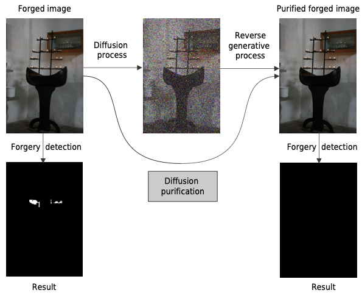
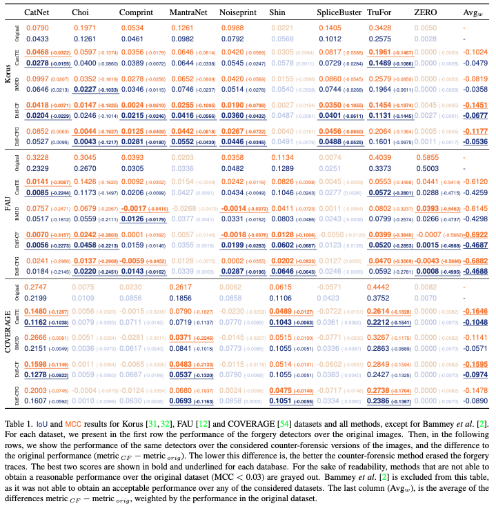
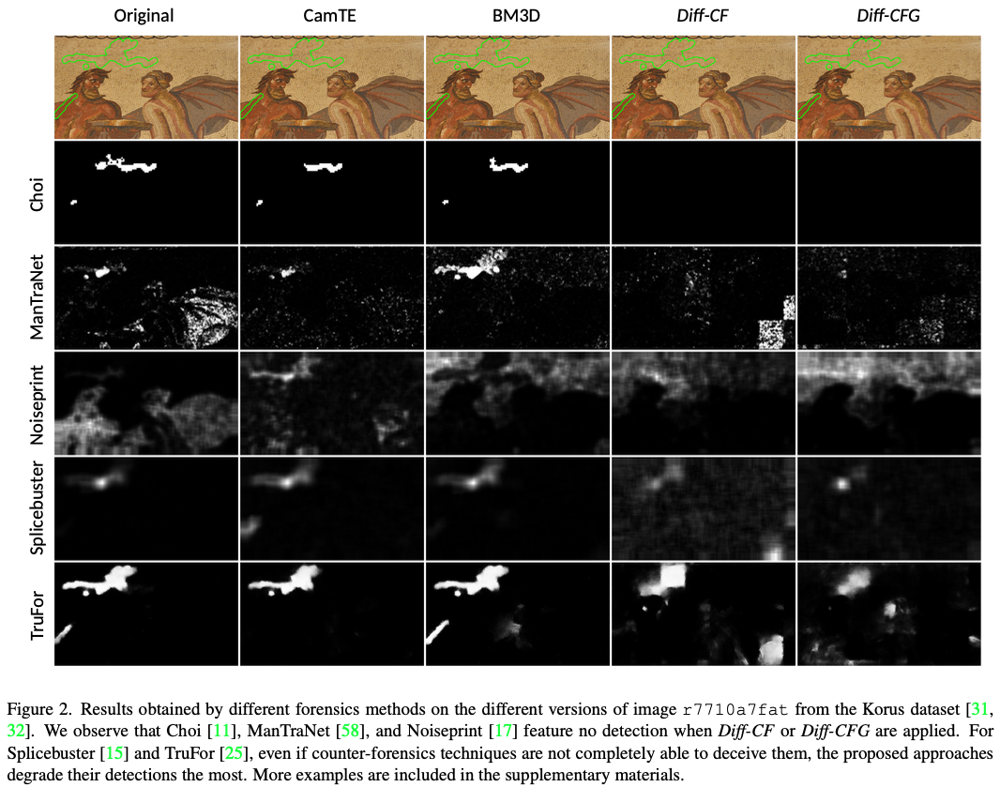
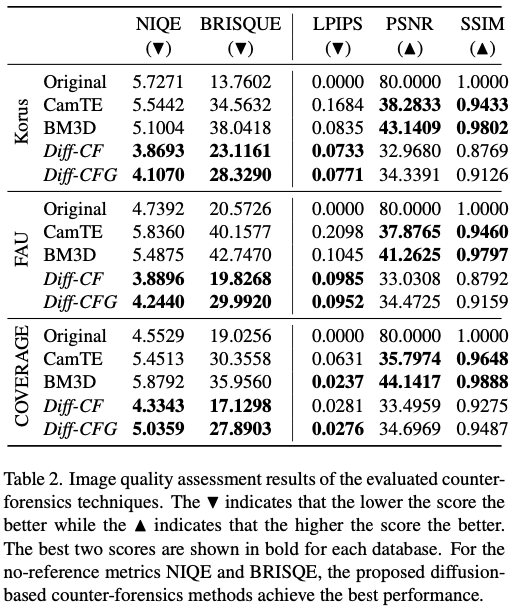
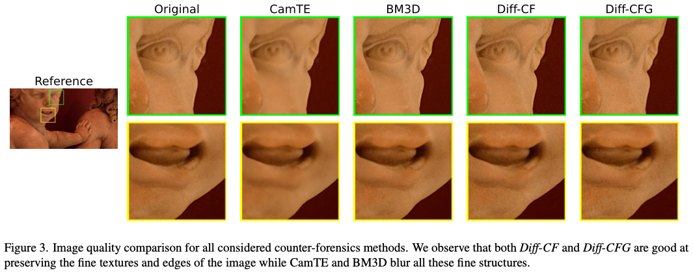

<!-- <div align="center"> -->

<div style="text-align: center;" markdown="1">

# Diffusion models meet image counter-forensics

[Link to code](https://www.github.com/mtailanian/diff-cf)

### Link to download paper:

[](https://openaccess.thecvf.com/content/WACV2024/papers/Tailanian_Diffusion_Models_Meet_Image_Counter-Forensics_WACV_2024_paper.pdf)
[](https://arxiv.org/abs/2311.13629)

</div>

### Citation:
```
@InProceedings{Tailanian_2024_WACV,
    author    = {Tailani\'an, Mat{\'\i}as and Gardella, Marina and Pardo, Alvaro and Mus\'e, Pablo},
    title     = {Diffusion Models Meet Image Counter-Forensics},
    booktitle = {Proceedings of the IEEE/CVF Winter Conference on Applications of Computer Vision (WACV)},
    month     = {January},
    year      = {2024},
    pages     = {3925-3935}
}
```
## Abstract
_From its acquisition in the camera sensors to its storage, different operations are performed to generate the final image. This pipeline imprints specific traces into the image to form a natural watermark. Tampering with an image disturbs these traces; these disruptions are clues that are used by most methods to detect and locate forgeries. In this article, we assess the capabilities of diffusion models to erase the traces left by forgers and, therefore, deceive forensics methods. Such an approach has been recently introduced for adversarial purification, achieving significant performance. We show that diffusion purification methods are well suited for counter-forensics tasks. Such approaches outperform already existing counter-forensics techniques both in deceiving forensics methods and in preserving the natural look of the purified images. The source code is publicly available at https://github.com/mtailanian/diff-cf._

<div style="text-align: center;" markdown="1">

</div>

# Setup 

This code is based on [guided-diffusion](https://github.com/openai/guided-diffusion). So first we start by adding this 
repo as a submodule:

```bash
git submodule add git@github.com:openai/guided-diffusion.git guided_diffusion
```

And we also need the latest version of `pytorch_ssim`:
```bash
git submodule add https://github.com/Po-Hsun-Su/pytorch-ssim.git pytorch_ssim
```

## Environment

Then, we create a conda virtual environment with the required packages:

```bash
conda create -n diff-cf python=3.10
conda activate diff-cf

cd guided_diffusion
pip install -e .
cd ..

cd pytorch_ssim
pip install -e .
cd ..

pip install -r requirements.txt
conda install mpi4py
```

## Download the pre-trained diffusion model
```bash
mkdir models
cd models
wget https://openaipublic.blob.core.windows.net/diffusion/jul-2021/256x256_diffusion_uncond.pt
cd ..
```

# Data
Save original images from all datasets (tested Korus, FAU, DSO-1, and Coverage) in the following structure:

```text
diff-cf
    ├── images
    │   ├── korus
    │   │   ├── original
    │   │   │   ├── 0001.png
    │   │   │   ├── 0002.png
    │   │   │   ├── ...
    │   ├── fau
    │   │   ├── original
    │   │   │   ├── ...
    ├── ...
```

# Run

This script runs Diff-CF and Diff-CFG over all tested datasets:
```bash
python main.py
```

And saves the purified images next to the `original` folder, for each variant


## Results

### Traces removal

The first point to evaluate is how well the proposed approaches remove the forgery traces. To do so, we ran several state-of-the-art forgery detection methods on the original datasets as well as in their counter-forensics versions (images purified using different techniques). To evaluate their capability of deceiving the forensics methods, we look at the difference between the detection performance before and after purification. The forensics methods that were used are: ZERO [44], Noiseprint [17], Splicebuster [15], ManTraNet [58], Choi [3, 11], Bammey [2], Shin [47], Comprint [38], CAT-Net [33, 34] and TruFor [25]. A brief description of each method can be found in the supplementary material.
<div style="text-align: center;" markdown="1">

</div>

<div style="text-align: center;" markdown="1">

</div>

### Image quality assessment
Another important point to evaluate the pertinence of counter-forensic methods is their resulting image quality. We evaluate this quality in two senses. Firstly, we are interested in how natural the purified images are. To evaluate this, we use the reference-free image quality assessment techniques NIQE [42] and BRISQE [41]. Secondly, it is also important to measure the similarity between the input image and the one obtained after the counter-forensic attack. We, of course, want these two images to be perceptually similar. To evaluate this aspect, we use the full reference image quality assessment methods LPIPS [62], SSIM [53], and PSNR. For all the metrics, we use the implementations provided by the PyIQA library [8].

The first point to evaluate is how well the proposed approaches remove the forgery traces. To do so, we ran several state-of-the-art forgery detection methods on the original datasets as well as in their counter-forensics versions (images purified using different techniques). To evaluate their capability of deceiving the forensics methods, we look at the difference between the detection performance before and after purification. The forensics methods that were used are: ZERO [44], Noiseprint [17], Splicebuster [15], ManTraNet [58], Choi [3, 11], Bammey [2], Shin [47], Comprint [38], CAT-Net [33, 34] and TruFor [25]. A brief description of each method can be found in the supplementary material.
<div style="text-align: center;" markdown="1">

</div>

<div style="text-align: center;" markdown="1">

</div>

# Copyright and License

This program is free software: you can redistribute it and/or modify
it under the terms of the GNU Affero General Public License as
published by the Free Software Foundation, either version 3 of the
License, or (at your option) any later version.

This program is distributed in the hope that it will be useful,
but WITHOUT ANY WARRANTY; without even the implied warranty of
MERCHANTABILITY or FITNESS FOR A PARTICULAR PURPOSE.  See the
GNU Affero General Public License for more details.

You should have received a copy of the GNU Affero General Public License
along with this program.  If not, see <http://www.gnu.org/licenses/>.